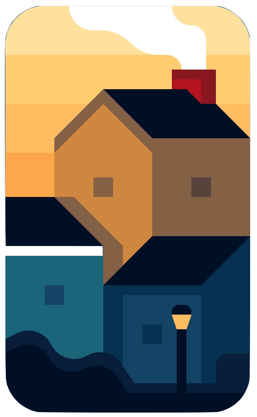

<!-- MIT License>
[![Contributors][contributors-shield]][contributors-url]
[![Forks][forks-shield]][forks-url]
[![Stargazers][stars-shield]][stars-url]
[![Issues][issues-shield]][issues-url]
[![MIT License][license-shield]][license-url]

<!-- PROJECT LOGO -->
<br />
<p align="center">
  <a href="https://github.com/grcasanova/AbodeMe">
    
  </a>

  <h3 align="center">AbodeMe</h3>

  <p align="center">
  Rent and let guest houses in a decentralised, secure and permissionless way<br />
    <br />
    <a href="https://grcasanova.github.io/AbodeMe">View Demo</a>
    ·
    <a href="https://github.com/grcasanova/AbodeMe/BUG-TEMPLATE.md">Report Bug</a>
    ·
    <a href="https://github.com/grcasanova/AbodeMe/FEATURE-REQUEST.md">Request Feature</a>
  </p>
</p>

<p align="center">
  
</p>

<!-- TABLE OF CONTENTS -->
<details open="open">
  <summary>Table of Contents</summary>
  <ol>
    <li>
      <a href="#about-the-project">About The Project</a>
      <ul>
        <li><a href="#built-with">Built With</a></li>
      </ul>
    </li>
    <li>
      <a href="#getting-started">Getting Started</a>
      <ul>
        <li><a href="#prerequisites">Prerequisites</a></li>
        <li><a href="#installation">Installation</a></li>
      </ul>
    </li>
    <li><a href="#usage">Usage</a></li>
    <li><a href="#roadmap">Roadmap</a></li>
    <li><a href="#contributing">Contributing</a></li>
    <li><a href="#license">License</a></li>
    <li><a href="#contact">Contact</a></li>
    <li><a href="#acknowledgements">Acknowledgements</a></li>
  </ol>
</details>


<!-- ABOUT THE PROJECT -->
## About The Project

One of the great things about holidays is to ease off your mind and enjoy your deserved free time without having to think about mundane practicalities. Sometimes, it is good to just pick a location and stay as much as you like without having to arrange everything beforehand.

That's why we have created *AbodeMe*. A decentralised platform that allows you to rent a property in a fluid way as we say, without any time limits just pay as you go on an hourly basis. The tenant can then enjoy a hassle-free rental experience while the landlord is paid continuously and is protected against accidental damage by a security deposit stored on the contract.
Upon starting the rental period, the tenant will be given the keycode to unlock the safety box with the entrance key, stored in *Secret Network* and burned after reading. In this way, the landlord doesn't have to always be present for the tenant and let them in.
Finally, by having the dapp run on *Polygon* we were able to reduce gas costs by approximately 70%, minting the NFT containing the property data costs just a fraction of dollar compared to the $60-80 figure in Ethereum mainnet.

Superfluid cashflows in xDAI allow capital value to be preserved from market fluctuations and can pave the way for a future implementation of a Polygon/xDAI bridge using *xPollinate*.

A few key features of the platform:
* completely decentralised
* privacy preserving
* security by default
* collateral deposit as insurance
* pay as you go, no hidden fees

### Future Ideas
Surely an integral part of the next development phase will be to debug Superfluid cashflows and port them to the *RentalToken* smart contract in order to avoid manipulation from the frontend as well as provide a better user experience. Secondly, users should be able to pay with Torus only, thus making Keplr wallet obsolete in the expected workflow towards a cleaner and more immediate user-centric interface.
Lastly, collaterals should be invested into yield farming protocols like *Aave* to generate a revenue to keep the dapp alive without having to charge users for the service.

### Built With

To bring *AbodeMe* to life we integrated the following awesome projects:

* [Polygon](https://polygon.technology)
* [SecretNetwork](https://scrt.network/)
* [SuperFluid](https://www.superfluid.finance)
* [Torus](https://tor.us)
* [IPFS](https://ipfs.io/)
* And a sprinkle of *ReactJs*

In particular, *Polygon* is the main L2 infrastructure allowing us to scale without unloading the costs to our users, *Secret Network* maintains the confidentiality of key locker codes, *SuperFluid* allows us to create dynamic cashflows, *Torus* acts as the main user wallet also providing email and username data while data and images are stored on *IPFS*.


<!-- GETTING STARTED -->
## Getting Started

Deploy a local copy of the project and test it yourself.

### Prerequisites

To setup the development environment, run the following commands:

* npm
  ```sh
  npm install --global npm@latest
  ```

* yarn
  ```sh
  npm install --global yarn@latest
  ```

You will also need to have some test MATIC tokens in your Torus wallet and to have installed [Keplr](https://wallet.keplr.app/#/dashboard) wallet with Secret Network switched on.

### Installation

To install the repository and run it locally:

1. Clone the repo
   ```sh
   git clone https://github.com/grcasanova/AbodeMe.git
   ```
2. Install nodejs packages with *yarn*
   ```sh
   yarn install
   ```
3. Start the app with
   ```sh
   yarn start
   ```

<!-- USAGE EXAMPLES -->
## Usage

Using *AbodeMe* is very simple, just head off the [Homepage](https://grcasanova.github.io/AbodeMe) and login with your Torus wallet. On the _rent_ page you can see a list of all properties to let and their location pinpointed on a map while on the _let_ page you can list your property and start earning. Once a new tenant accepts the rental agreement you will both receive a welcome email to exchange contacts and you're good to go.
In the _dashboard_ you can find all your properties to let and the ones you're currently renting and eventually stop the rental agreement once you want to leave the guest house.

<!-- ROADMAP -->
## Roadmap

See the [open issues](https://github.com/grcasanova/AbodeMe/issues) for a list of proposed features (and known issues).

<!-- CONTRIBUTING -->
## Contributing

Contributions are what make the open source community such an amazing place to be learn, inspire, and create. Any contributions you make are **greatly appreciated**.

1. Fork the Project
2. Create your Feature Branch (`git checkout -b feature/AmazingFeature`)
3. Commit your Changes (`git commit -m 'Add some AmazingFeature'`)
4. Push to the Branch (`git push origin feature/AmazingFeature`)
5. Open a Pull Request and describe your proposal

<!-- LICENSE -->
## License

Distributed under the MIT License. See `LICENSE` for more information.

<!-- CONTACT -->
## Contact

Web Link: [Homepage](https://grcasanova.github.io/AbodeMe)

<!-- AUTHORS -->
## Authors
* [grcasanova](https://github.com/grcasanova)
* [metypes](https://github.com/metypes)

<!-- ACKNOWLEDGEMENTS -->
## Acknowledgements
* [ReactJs](https://reactjs.org)
* [Ethereum](https://ethereum.org)
* [Gitcoin](https://gitcoin.co)
* [Bootstrap](https://getbootstrap.com)

<!-- MARKDOWN LINKS & IMAGES -->
<!-- https://www.markdownguide.org/basic-syntax/#reference-style-links -->
[contributors-shield]: https://img.shields.io/github/contributors/grcasanova/AbodeMe.svg?style=for-the-badge
[contributors-url]: https://github.com/grcasanova/AbodeMe/graphs/contributors
[forks-shield]: https://img.shields.io/github/forks/grcasanova/AbodeMe.svg?style=for-the-badge
[forks-url]: https://github.com/grcasanova/AbodeMe/network/members
[stars-shield]: https://img.shields.io/github/stars/grcasanova/AbodeMe.svg?style=for-the-badge
[stars-url]: https://github.com/grcasanova/AbodeMe/stargazers
[issues-shield]: https://img.shields.io/github/issues/grcasanova/AbodeMe.svg?style=for-the-badge
[issues-url]: https://github.com/grcasanova/AbodeMe/issues
[license-shield]: https://img.shields.io/github/license/grcasanova/AbodeMe.svg?style=for-the-badge
[license-url]: https://github.com/grcasanova/AbodeMe/blob/master/LICENSE.txt
[product-screenshot]: images/screenshot.png
